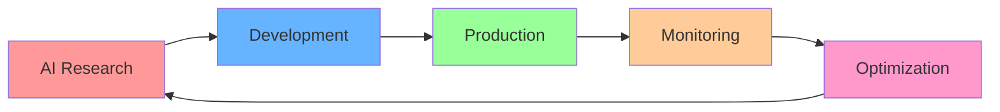

# Youssef Ben Moussa

**AI Engineer | Founder & Co-founder | Innovation Architect**  
*"Designing intelligent systems like nature builds hives — one hexagon at a time."*

  
  
  

---

### **IMPACT METRICS**

<table align="center">
<tr>
<td align="center"><b>Active Projects</b> 4+ Production APIs</td>
<td align="center"><b>AI Models Deployed</b> 15+ Systems</td>
<td align="center"><b>Cloud Infrastructure</b> Multi-Cloud Expert</td>
<td align="center"><b>Global Reach</b> International Collaboration</td>
</tr>
</table>

---

## **ABOUT ME**

> **Transforming complex AI research into scalable production systems**

I'm an **AI Engineer** with a **modular mindset** and laser focus on **MLOps, Agent Orchestration & Intelligent Automation**.  
My passion lies in **bridging the gap** between cutting-edge research and real-world applications that create tangible value.

### **CURRENT INNOVATION PIPELINE**

<table>
<tr>
<td width="50%">

**ACTIVE PROJECTS**
- **Instagram Analytics API** → AI-Vision powered insights
- **Website Analyzer API** → Advanced SEO & tech analysis  
- **YouTube Analytics Pro** → Automated data pipelines
- **AI-Agent Orchestration Hub** → Multi-agent ecosystems

</td>
<td width="50%">

**SPECIALIZATION AREAS**
- **Generative AI & LLMs**
- **Agent Orchestration & Memory**
- **AI Automation & Workflows**
- **Computer Vision & Multimodal**
- **MLOps & Cloud Infrastructure**

</td>
</tr>
</table>

---

## **TECHNOLOGY STACK**

### **ARTIFICIAL INTELLIGENCE & MACHINE LEARNING**

### **MLOPS & DEVOPS**

### **CLOUD & INFRASTRUCTURE**

### **FULL STACK DEVELOPMENT**

---

## **FEATURED PROJECTS**

<table>
<tr>
<td width="25%" align="center">
 
<b>AI-Vision Insights</b> 
FastAPI • OpenAI Vision • Docker
</td>
<td width="25%" align="center">
 
<b>SEO & Tech Analysis</b> 
FastAPI • Docker • CI/CD
</td>
<td width="25%" align="center">
 
<b>Video Insights Pipeline</b> 
Python • Docker • Automation
</td>
<td width="25%" align="center">
 
<b>Multi-Agent Hub</b> 
LangChain • CrewAI • Redis
</td>
</tr>
</table>

### **DEVELOPMENT WORKFLOW**

---

## **PROFESSIONAL NETWORK & VENTURES**

<table>
<tr>
<td width="33%" align="center">
 
<b><a href="https://youssef-ben.com">youssef-ben.com</a></b> 
Professional Showcase
</td>
<td width="33%" align="center">
 
<b><a href="https://studioinnovativo.it">Studio Innovativo</a></b> 
Innovation Agency
</td>
<td width="33%" align="center">
 
<b><a href="http://geniapp.it">GeniApp</a></b> 
AI Startup Venture
</td>
</tr>
</table>

### **CONNECT & COLLABORATE**

---

### **"Every project is one more hexagon in my AI ecosystem."**

 

**CURRENTLY AVAILABLE FOR:**
- Senior AI Engineering Roles
- Technical Leadership Positions  
- Innovative AI Project Collaborations
- International Opportunities

 

 

