# Youssef Ben Moussa

**🌟 AI Engineer | Founder & Co-founder | Innovation Architect**  
*"Designing intelligent systems like nature builds hives — one hexagon at a time."*

  
  
  

---

### 🔥 **IMPACT METRICS**

<table align="center">
<tr>
<td align="center"><b>🎯</b> <b>Active Projects</b> <b>4+ Production APIs</b></td>
<td align="center"><b>🤖</b> <b>AI Models Deployed</b> <b>15+ Systems</b></td>
<td align="center"><b>☁️</b> <b>Cloud Infrastructure</b> <b>Multi-Cloud Expert</b></td>
<td align="center"><b>ğŸŒ</b> <b>Global Reach</b> <b>International Collaboration</b></td>
</tr>
</table>

---

## 🚀 **ABOUT ME**

> **Transforming complex AI research into scalable production systems**

I'm an **AI Engineer** with a **modular mindset** and laser focus on **MLOps, Agent Orchestration & Intelligent Automation**.  
My passion lies in **bridging the gap** between cutting-edge research and real-world applications that create tangible value.

### 🎯 **CURRENT INNOVATION PIPELINE**

<table>
<tr>
<td width="50%">

**🔥 ACTIVE PROJECTS**
- 📷 **Instagram Analytics API** → AI-Vision powered insights
- 🌐 **Website Analyzer API** → Advanced SEO & tech analysis  
- 📺 **YouTube Analytics Pro** → Automated data pipelines
- 🤖 **AI-Agent Orchestration Hub** → Multi-agent ecosystems

</td>
<td width="50%">

**⚡ SPECIALIZATION AREAS**
- 🧠 **Generative AI & LLMs**
- 🔄 **Agent Orchestration & Memory**
- 🤖 **AI Automation & Workflows**
- 👁️ **Computer Vision & Multimodal**
- ☁️ **MLOps & Cloud Infrastructure**

</td>
</tr>
</table>

---

## 🛠️ **TECHNOLOGY ARSENAL**

### 🧠 **ARTIFICIAL INTELLIGENCE & MACHINE LEARNING**

### ⚙️ **MLOPS & DEVOPS MASTERY**

### ☁️ **CLOUD & INFRASTRUCTURE**

### 🌐 **FULL STACK DEVELOPMENT**

---

## 🏆 **FEATURED PROJECTS SHOWCASE**

<table>
<tr>
<td width="25%" align="center">
 
<b>AI-Vision Insights</b> 
FastAPI • OpenAI Vision • Docker
</td>
<td width="25%" align="center">
 
<b>SEO & Tech Analysis</b> 
FastAPI • Docker • CI/CD
</td>
<td width="25%" align="center">
 
<b>Video Insights Pipeline</b> 
Python • Docker • Automation
</td>
<td width="25%" align="center">
 
<b>Multi-Agent Hub</b> 
LangChain • CrewAI • Redis
</td>
</tr>
</table>

### 🌟 **PROJECT HIGHLIGHTS**

```mermaid
graph LR
    A[🧠 AI Research] --> B[⚙️ Development]
    B --> C[🚀 Production]
    C --> D[📊 Monitoring]
    D --> E[🔄 Optimization]
    E --> A
    
    style A fill:#ff9999
    style B fill:#66b3ff
    style C fill:#99ff99
    style D fill:#ffcc99
    style E fill:#ff99cc
```

---

## 🌟 **PROFESSIONAL NETWORK & VENTURES**

<table>
<tr>
<td width="33%" align="center">
 
<b><a href="https://youssef-ben.com">youssef-ben.com</a></b> 
Professional Showcase
</td>
<td width="33%" align="center">
 
<b><a href="https://studioinnovativo.it">Studio Innovativo</a></b> 
Innovation Agency
</td>
<td width="33%" align="center">
 
<b><a href="http://geniapp.it">GeniApp</a></b> 
AI Startup Venture
</td>
</tr>
</table>

### 📞 **LET'S CONNECT & COLLABORATE**

---

### 💡 **"Every project is one more hexagon in my AI ecosystem."**

 

**🔥 CURRENTLY AVAILABLE FOR:**
- Senior AI Engineering Roles
- Technical Leadership Positions  
- Innovative AI Project Collaborations
- International Opportunities

 

 

